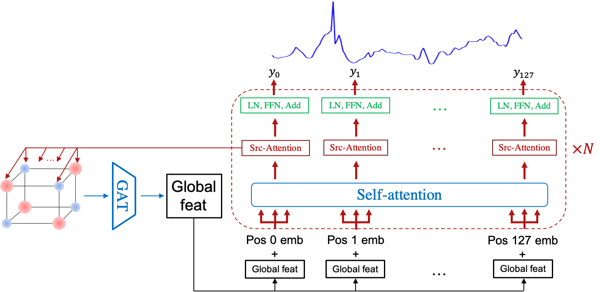

# Xtal2DoS: Attention-based Crystal to Sequence Learning for Density of States Prediction

The implementation of Xtal2DoS using PyTorch.

# Sample Dataset
Datasets are stored in `../xtal2dos_DATA/`.

# Environment
Run `./install.sh`

# Dependencies
- Python 3.10.4
- PyTorch 1.11.0
- numpy 1.22.4
- sklearn 1.1.1
- cuda 11.3

Older versions might work as well.

# Run
To train the model:
``bash scrips/run_train.sh``

To test the model:
``bash scripts/run_test.sh``

